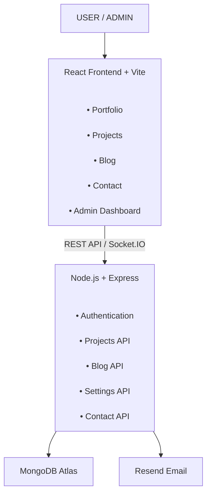

## System Architecture


## 2. Technological Stack

| Category | Technology |
|---|---|
| UI | React |
| Build Tool | Vite |
| HTML / CSS / JavaScript | React + CSS + JavaScript |
| Backend | Node.js |
| API | Express.js REST API |
| Database | MongoDB |
| Database Hosting | MongoDB Atlas |
| Authentication | JWT |
| Password Security | bcrypt |
| Authorization | Admin Middleware |
| Real-time Updates | Socket.IO |
| Animations | Framer Motion |
| Icons | Lucide React |
| Email | Resend |
| Security | Helmet + CORS + Rate Limiting |
| Frontend Deployment | Vercel |
| Backend Deployment | Render |
| Source Control | Git + GitHub |

## 3. Project Folder Structure

```text
portfolio-cms/
│
├── client/
│   ├── public/
│   │
│   ├── src/
│   │   ├── components/
│   │   │   └── Navbar.jsx
│   │   │
│   │   ├── pages/
│   │   │   ├── Home.jsx
│   │   │   ├── Login.jsx
│   │   │   └── Dashboard.jsx
│   │   │
│   │   ├── App.jsx
│   │   ├── api.js
│   │   ├── main.jsx
│   │   └── styles.css
│   │
│   ├── .env.example
│   ├── index.html
│   ├── package.json
│   ├── vercel.json
│   └── vite.config.js
│
├── server/
│   ├── src/
│   │   ├── config/
│   │   │   └── db.js
│   │   │
│   │   ├── middleware/
│   │   │   └── auth.js
│   │   │
│   │   ├── models/
│   │   │   ├── User.js
│   │   │   ├── Project.js
│   │   │   ├── Post.js
│   │   │   └── Settings.js
│   │   │
│   │   ├── routes/
│   │   │   ├── auth.routes.js
│   │   │   ├── project.routes.js
│   │   │   ├── post.routes.js
│   │   │   ├── settings.routes.js
│   │   │   └── contact.routes.js
│   │   │
│   │   ├── app.js
│   │   ├── server.js
│   │   ├── socket.js
│   │   └── seedAdmin.js
│   │
│   ├── .env.example
│   └── package.json
│
├── docs/
│   └── API.md
│
├── render.yaml
├── .gitignore
└── README.md
```
